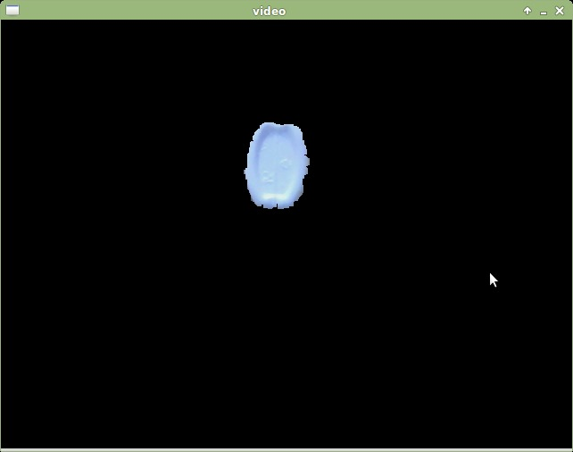
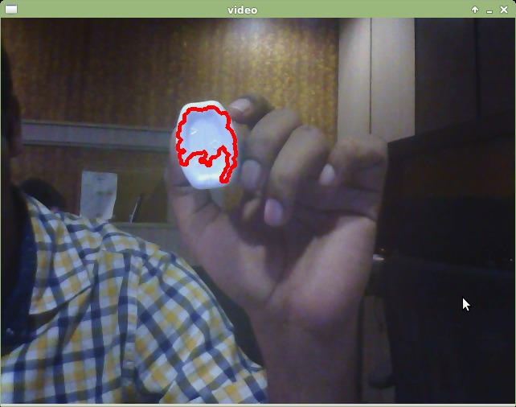
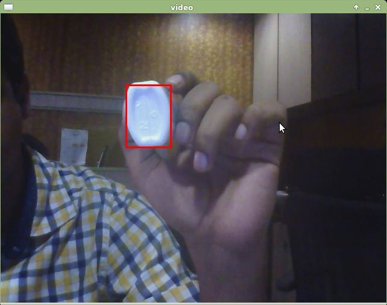

## How to Run
This is a simple color based tracker using OpenCV back-projection inspired by [pyimagesearch's Ball Tracking ](http://www.pyimagesearch.com/2015/09/14/ball-tracking-with-opencv/) post

To Run this code:   
* `python track_color.py`
* use the mouse-pointer to select the colored  object you want to track. Double-click the desired colored object. 
* press 'b' to cycle through different views.

## Output

    Masked output: 
    

    Contour output: 
    

    Bounded Rectangle output: 
    

